# YWD Motor Control — CAN-FD GUI

A cross-platform (Linux) desktop application for real-time control and
monitoring of **YWD smart motors** over a **CAN-FD bus**. It implements the
*YWD CAN-FD Smart Motor Control Protocol V0.1* and the *YWD CAN-FD Aggregate
Frame Protocol V0.1* and provides:

- Three closed-loop control modes — **MIT**, **Pos-Vel** (position + velocity
  limit), and **Constant Velocity** — each running in either *single-motor
  frame* or *aggregate frame* (multi-motor) form.
- Motor **system commands** (enable / disable / zeroing / fault clear /
  save / reset / restore defaults).
- **Real-time feedback** table with state, fault code, position, velocity,
  torque, bus voltage and temperature telemetry.
- **Register access**: single-register read/write and full "Read All" batch
  reads with automatic unit scaling.
- **Live waveform plotting** with per-motor curves, zoom, and history review.

---

## 1. Hardware Requirements

The application talks to the CAN-FD bus through a **ZLG (周立功) ZCAN-series
CAN-FD adapter** using the official **ZCAN / VCI driver library** (`usbcanfd`).

> This is the **only** supported hardware path — a ZLG CAN-FD adapter must be
> plugged into a USB port before the software can connect.

Recommended hardware:

| Item | Requirement |
|------|-------------|
| CAN-FD adapter | ZLG **USBCANFD-200U** (or any ZCAN-series CAN-FD device) |
| Driver library | `libusbcanfd.so` (ZLG ZCAN SDK) + header `zcan.h` |
| Bus wiring | CAN_H / CAN_L terminated with 120 Ω at both ends, GND shared |
| Motors | YWD smart motors with NODE_ID 0x01…0x03 (default node address 1) |

Fixed device parameters used by the software:

| Parameter | Value |
|-----------|-------|
| Device type | `DEV_TYPE = 33` (ZCAN) |
| Device index / channel | `0 / 0` |
| Clock | 60 MHz |
| Arbitration bit-rate | **1 Mbps** (BRP=2, TSEG1=14, TSEG2=3, SJW=3, triple sampling) |
| FD data bit-rate | **5 Mbps** (BRP=2, TSEG1=1, TSEG2=0, SJW=0, single sampling) |
| Frame format | Standard 11-bit ID, CAN-FD, **BRS** enabled |
| Reception filter | Accept all standard frames |

If your bus uses a different bit-rate, adjust the constants at the top of
`src/canfd_device.cpp` (`ARB_BRP`/`ARB_TSEG1`/… and `DATA_*`) and rebuild.

---

## 2. Dependencies and Build

Prerequisites (Linux):

- Qt 5 with **Widgets**, **Core** and **Charts** modules
- CMake ≥ 3.10 and a C++17 compiler
- ZLG ZCAN SDK: `zcan.h` and `libusbcanfd.so`

Build:

```bash
cmake -S . -B build \
      -DZLG_INCLUDE_DIR=/path/to/zcan/sdk/inc \
      -DZLG_LIB_DIR=/path/to/zcan/sdk/lib
cmake --build build
```

If the ZCAN SDK is already installed in a standard location you can omit the
two `-D` options. The resulting binary is `build/YWD_Motor_Control`.

Run:

```bash
sudo ./build/YWD_Motor_Control        # USB access to the adapter usually needs root
```

> The project references the protocol specifications in
> `YWD CAN‑FD 智能电机控制协议 V0.1（草案）.md` and
> `YWD_CANFD_聚合帧协议_V0.1.md` — keep them next to the executable if you
> want the exact wire-format details.

---

## 3. Quick Start

1. **Wire the hardware.** Plug the ZLG CAN-FD adapter into a USB port and
   connect CAN_H / CAN_L to the motor bus (both ends terminated with 120 Ω,
   common GND). Power the motors.
2. **Launch** the application (`sudo ./build/YWD_Motor_Control`). The device
   combo box at the top shows `ZCAN1` and the status light is grey
   (`Disconnected`).
3. **Connect.** Press **Connect**. The light turns green, the label reads
   `Connected`, the log shows `Device opened successfully.` and the status
   bar shows `RX: 0 | Feedback: 0.0 Hz`.
   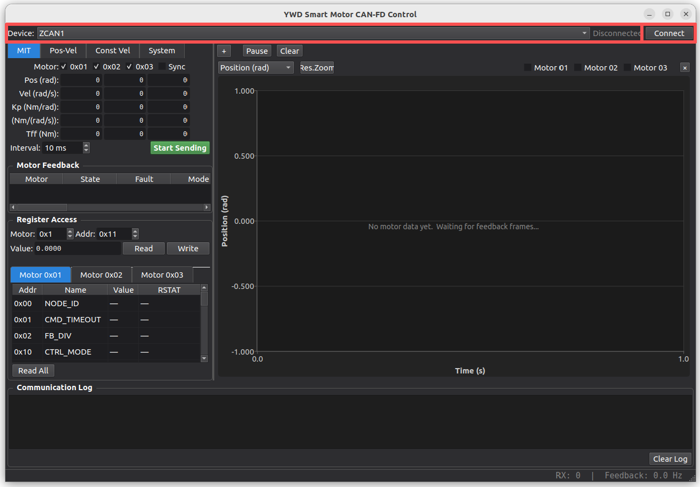
4. **Read the motor parameters.** Open the register page `Motor 0x01` and
   press **Read All** (§8.2). This loads `PMAX`/`VMAX`/`TMAX` so the control
   scaling of the mode tabs is correct.
   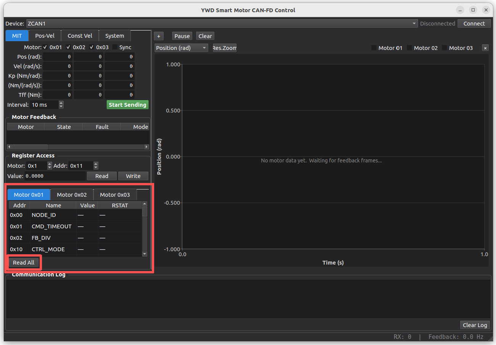
5. **Enable the motor.** Go to the **System** tab, tick `Motor 01`, press
   **Enable**. The **Motor Feedback** table now shows live rows for the
   motor (state, fault code, position, velocity, torque, voltage,
   temperatures) even before you send any setpoint.
   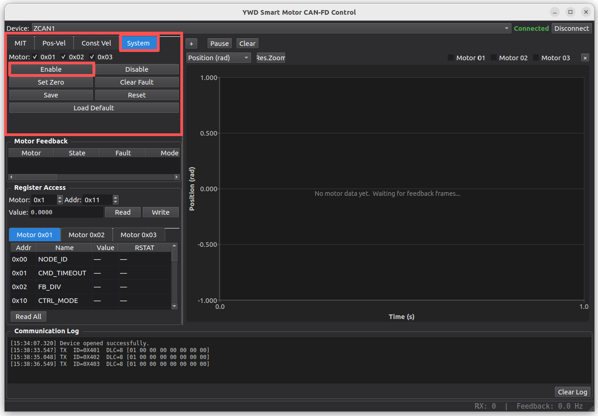
6. **Send a target.** Go to the **MIT** tab, tick `Motor 01`, enter a target
   position e.g. `0.5` rad, keep the default velocity / `Kp` / `Kd` / `Tff`
   values and the default 10 ms interval, then press **Start Sending**.
   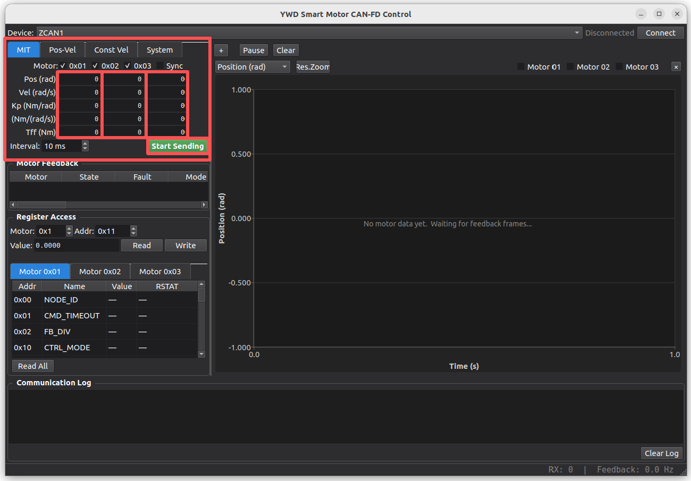
7. **Watch it move.** The motor moves to the target while the feedback table
   and the plot panel update in real time. Check the plot: the `Position`
   curve should converge to 0.5 rad (§9).
8. **Stop and release.** Press **Stop Sending**, then go back to the
   **System** tab and press **Disable**.

---

## 4. Main Window Layout

The window is split into three vertical regions:

1. **Top bar** — device combo (`ZCAN1`), connection status light, and the
   **Connect / Disconnect** toggle button.
2. **Middle area** (splitter):
   - **Left panel**:
     - Control-mode tab widget (**MIT / Pos-Vel / Const Vel / System**).
     - **Motor Feedback** table.
     - **Register Access** group (single read/write + per-motor tables).
   - **Right panel**: the waveform plot panel.
3. **Bottom** — the **Communication Log** with a `Clear Log` button.

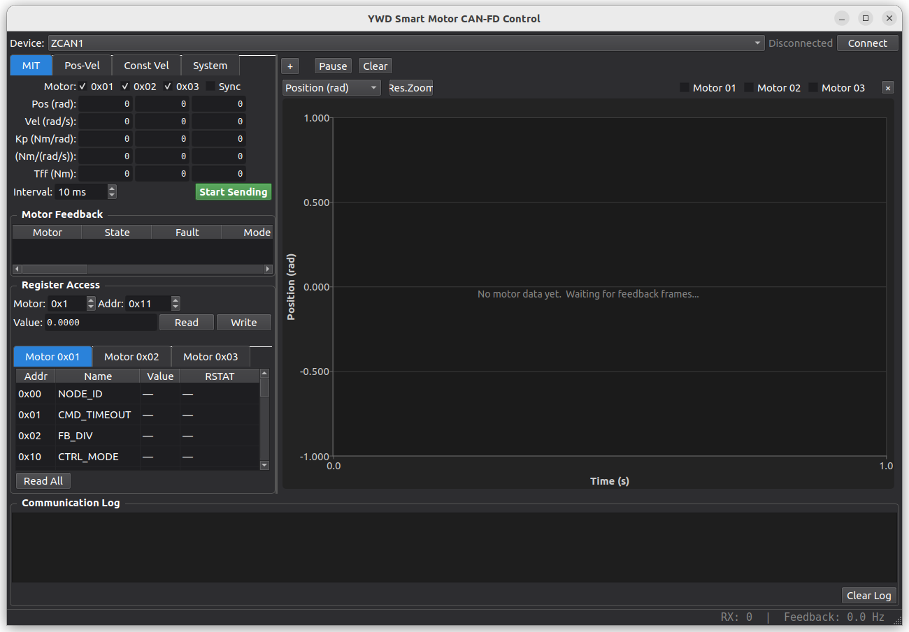

The status bar shows the total received frame count and the live feedback
rate in Hz (updated every 1 s).

---

## 5. Control Modes

All control values are entered as **decimal text boxes** (`QLineEdit`).
Each motor (01…03) has its own row of inputs; tick a motor's checkbox to
include it in the transmission. **Mode ownership is exclusive**: a motor can
be ticked in only one mode tab at a time — ticking it elsewhere automatically
stops the sending in the previous mode.

The **Sync** checkbox of each mode lets all ticked motors share the inputs of
**Motor 01** (useful to drive a group with identical targets).

The **send interval** spinner sets the control period (ms). Press
**Start Sending** to begin, **Stop Sending** to halt. Values are re-read from
the text boxes at each tick, so you can edit targets while running.

> **Single vs. aggregate frames**
> If **one** motor is ticked, the software transmits a *single-motor control
> frame* (`0x100|node` / `0x180|node` / `0x200|node`). If **two or three**
> motors are ticked, it automatically switches to the *aggregate control
> frame* for that mode (`0x001` MIT, `0x002` Pos-Vel, `0x003` Const Vel) which
> packs all motors into one frame (protocol §3). Both encodings are fully
> equivalent; the mode of a running transmission is indicated by the log
> (`TX agg ...` vs `TX ...`).

### 5.1 MIT Mode (`0x100|node`, aggregate `0x001`)

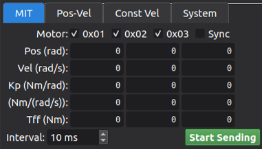

Per-motor inputs:

| Input | Meaning | Unit | Encoding (LSB) |
|-------|---------|------|----------------|
| `P_des`  | Target position        | rad        | `pos / PMAX * (2³¹−1)` (int32) |
| `V_des`  | Target velocity        | rad/s      | `vel / VMAX * 32767` (int16)   |
| `Kp`     | Stiffness              | N·m/rad    | `0.01` per LSB (uint16)        |
| `Kd`     | Damping                | N·m·s/rad  | `0.001` per LSB (uint16)       |
| `T_ff`   | Feed-forward torque    | N·m        | `trq / TMAX * 32767` (int16)   |

> `PMAX` / `VMAX` / `TMAX` are read from the motor registers (0x11/0x12/0x13)
> whenever a register read succeeds, so the scaling always matches the
> connected motor.

- Interval range 1–5000 ms, default **10 ms** (100 Hz).
- For >1 motor the aggregate frame additionally carries each motor's
  `acc`/`dec` fields (0 = use register defaults) and a sequence number; see
  §5.4.

### 5.2 Pos-Vel Mode (`0x180|node`, aggregate `0x002`)

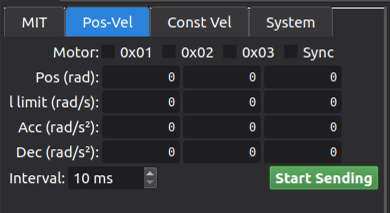

Per-motor inputs:

| Input | Meaning | Unit | Encoding |
|-------|---------|------|----------|
| `Pos`    | Target position     | rad     | `pos / PMAX * (2³¹−1)` (int32) |
| `VelLim` | Velocity limit      | rad/s   | **normalized** `vel/VMAX * 65535` (uint16) |
| `Acc`    | Acceleration        | rad/s²  | `1` per LSB (uint16); **0 = register default** |
| `Dec`    | Deceleration        | rad/s²  | `1` per LSB (uint16); **0 = register default** |

- Interval range 10–5000 ms, default **10 ms**.

### 5.3 Const Vel Mode (`0x200|node`, aggregate `0x003`)

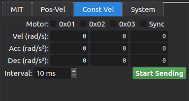

Per-motor inputs:

| Input | Meaning | Unit | Encoding |
|-------|---------|------|----------|
| `Vel`   | Target velocity     | rad/s   | `vel / VMAX * 32767` (int16)  |
| `Acc`   | Acceleration        | rad/s²  | `1` per LSB (uint16); **0 = register default** |
| `Dec`   | Deceleration        | rad/s²  | `1` per LSB (uint16); **0 = register default** |

- Interval range 10–5000 ms, default **10 ms**.

### 5.4 Notes on the aggregate control frames (protocol §3)

Aggregate control frames (`0x001/0x002/0x003`) pack one 17-byte record per
motor — NODE_ID + 16-byte body identical in layout to the single-frame body —
plus a header and an optional 6-byte CRC-stats trailer. The GUI always
constructs them with a header carrying the record count and a rolling
sequence byte so the firmware can detect packet loss. You do not need to
manage any of this manually.

### 5.5 Step-by-step: drive a motor in each mode

Common preconditions: the device is connected, the motor is **Enabled**
(System tab), and `PMAX`/`VMAX`/`TMAX` are known so the scaling is correct —
run **Read All** (§8.2) once, or read each register once, to refresh them.

**MIT mode** (stiffness/damping position control) — typical first smoke test:

1. Open the **MIT** tab. Tick `Motor 01`.
2. Enter a target position, e.g. `P_des = 1.0` (rad).
3. Set a moderate stiffness `Kp = 2.0` (N·m/rad) and damping `Kd = 0.05`
   (N·m·s/rad); `V_des` and `T_ff` can stay `0`.
4. Press **Start Sending**. The motor first holds its current position, then
   moves smoothly to 1.0 rad.
5. While running you can edit `P_des` — the new value is sent on the next
   tick (interval default 10 ms), so you can "drag" the motor live.
6. Verify in the plot panel that `Position` converges to 1.0 rad, then press
   **Stop Sending**.

**Pos-Vel mode** (position + velocity limit) — point-to-point moves with a
controlled ramp:

1. Open the **Pos-Vel** tab, tick `Motor 01`.
2. Enter `Pos = 3.0` (rad) and `VelLim = 5.0` (rad/s).
3. Set `Acc = 10` and `Dec = 10` (rad/s²) so the motion ramps instead of
   jumping; leaving them `0` uses the register defaults (0x14 / 0x15).
4. Press **Start Sending**. The motor accelerates to the velocity limit,
   cruises, then decelerates into the target position.
5. In the plot, `Velocity` should saturate at (or below) `VelLim` during the
   cruise phase. Press **Stop Sending** when done.

**Const Vel mode** (velocity source) — continuous rotation / conveyor use:

1. Open the **Const Vel** tab, tick `Motor 01`.
2. Enter `Vel = 6.28` (rad/s, ≈ 1 rev/s) and, for a smooth start,
   `Acc = 20`, `Dec = 20` (rad/s²).
3. Press **Start Sending**; the motor spins at constant velocity.
4. While running, type a different `Vel` (e.g. `-6.28` to reverse) — it
   takes effect on the next tick.
5. Press **Stop Sending**; the motor decelerates and stops.

**Driving 2–3 motors at once:**

1. Tick `Motor 01` and `Motor 02` in the same mode tab.
2. Fill in each motor's row individually, or tick **Sync** so both motors
   receive Motor 01's parameters.
3. Press **Start Sending**. The log shows `TX agg` and the GUI sends the
   aggregate control frame (`0x001/0x002/0x003`).
4. Feedback for both motors arrives on `0x701/0x702/0x703` and is decoded
   automatically; tick both motors in the plot panel to see both curves.

---

## 6. System Commands (`0x400|node`)

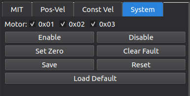

Tick the motor(s) to command, then press one of the buttons. A frame is sent
per ticked motor.

| Button | Cmd code | Purpose |
|--------|----------|---------|
| Enable      | 0x01 | Enable the motor controller (required before sending motion) |
| Disable     | 0x02 | Disable / release the motor |
| Set Zero    | 0x03 | Set current position as zero reference |
| Clear Fault | 0x04 | Clear the latched fault state |
| Save        | 0x05 | Persist current parameters to non-volatile memory |
| Reset       | 0x06 | Soft reset the controller |
| Load Default| 0x07 | Restore factory default parameters |

A typical power-up → motion → release sequence:

1. **Enable** every motor you plan to move.
2. Watch the feedback table until each motor shows a healthy state (e.g.
   `4:Run`) and a fault code of `0`.
3. Optionally press **Set Zero** to make the current position the new zero
   reference before commanding positions.
4. Start a control mode (§5.5) and press **Stop Sending** when done.
5. Press **Disable** so the motors release torque safely.

> After changing parameters via the Register Access panel, use **Save** to
> make them permanent.

---

## 7. Motor Feedback

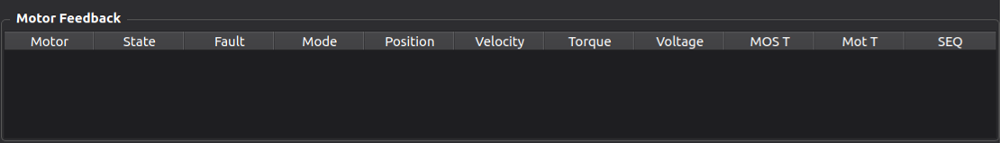

Feedback arrives on `0x600|node` (single-motor frame) and on the aggregate
feedback frames `0x701` (MIT), `0x702` (Pos-Vel), `0x703` (Const Vel) — the
latter carry one record per controlled motor and are decoded by the
application into the same pipeline (§5.2 of the aggregate protocol). Both
formats update the table and the plot identically.

### 7.1 Feedback table

| Column | Content |
|--------|---------|
| Motor | NODE_ID as `0x01`…`0x03` |
| State | Running state, see below |
| Fault | Fault code (hex), see below |
| Mode  | Current control mode number |
| Position | Measured position (rad) |
| Velocity | Measured velocity (rad/s) |
| Torque | Measured torque (N·m) |
| Voltage | Bus voltage (V) |
| MOS T | Power-stage temperature (°C) |
| Mot T | Motor winding temperature (°C) |
| SEQ | Feedback sequence number (packet-loss detection) |

State names (protocol §7.2): `0:Init`, `1:Idle`, `2:Calib`, `3:Ready`,
`4:Run`, `5:Stop`, `6:Error`, `7:Test`, `8:DFU`.

### 7.2 Fault codes (protocol §7.3)

| Code | Meaning |
|------|---------|
| 0x00 | No fault |
| 0x01 | Overvoltage |
| 0x02 | Undervoltage |
| 0x03 | Overcurrent |
| 0x04 | MOS over-temperature |
| 0x05 | Motor over-temperature |
| 0x06 | Communication lost (watchdog) |
| 0x07 | Overload |
| 0x08 | Encoder error |
| 0x09 | Mode mismatch |
| others | Reserved |

A row with a non-zero fault is highlighted with a dark-red background and the
Fault cell tooltip explains the code. Clear faults with the **Clear Fault**
system command after removing the cause.

---

## 8. Register Access

### 8.1 Single-register read / write

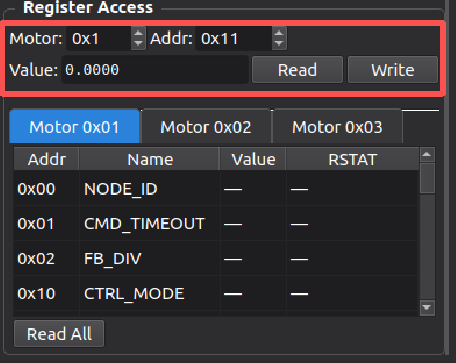

- **Motor** spin box: NODE_ID (0x00…0x7F).
- **Addr** spin box: register address (0x00…0xFF, hexadecimal display).
- **Value** edit box: typed value — `float32` registers accept a decimal
  number (e.g. `0.5`), `int32`/`uint32` accept an integer. Parsing follows the
  register catalogue, so a wrong format is rejected with a red error label.
- **Read** — sends a read request (`0x700|node`, cmd 0x02) and shows the
  result as `0xADDR = value` in green.
- **Write** — sends a write request (cmd 0x01) and reports `Write OK` on
  success.

Responses also carry an **RSTAT** status byte (protocol §8.3):

| RSTAT | Meaning |
|-------|---------|
| 0 | OK |
| 1 | Unknown RID |
| 2 | Read-only |
| 3 | Out of range |
| 4 | State forbid |

### 8.2 Per-motor register tables & "Read All"

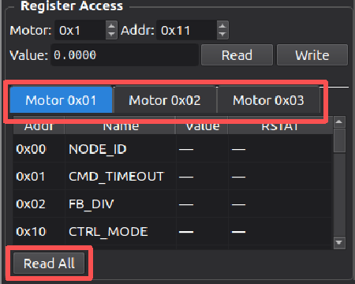

For each motor (01…03) there is a page with the **full register catalogue**
columns `Addr | Name | Value | RSTAT`. Press **Read All** to read every
register of that motor:

- The read is performed in **blocks of 8 registers per request** (block-read
  protocol §8.2), driven by the responses: after each block reply the next
  block is requested, with a 200 ms timeout and up to 3 retries per block
  before skipping.
- Progress is shown as `read / total` next to the button; the button re-enables
  and shows `Done` when finished.
- Values are displayed **unit-decoded** (e.g. `PMAX` in rad, `VB` in V, `KT`
  in N·m/A) and cached; the cache is refreshed whenever a value is read
  again.

### 8.3 Register catalogue (addr — name — type)

| Addr | Name | Type | Addr | Name | Type |
|------|------|------|------|------|------|
| 0x00 | NODE_ID | uint32 | 0x01 | CMD_TIMEOUT | uint32 |
| 0x02 | FB_DIV | uint32 | | | |
| 0x10 | CTRL_MODE | uint32 | 0x11 | PMAX | float32 |
| 0x12 | VMAX | float32 | 0x13 | TMAX | float32 |
| 0x14 | ACC | float32 | 0x15 | DEC | float32 |
| 0x18 | P_SOFT | float32 | 0x19 | V_SOFT | float32 |
| 0x1A | T_SOFT | float32 | 0x1B | ACC_SOFT | float32 |
| 0x1C | DEC_SOFT | float32 | | | |
| 0x20 | KP_CUR | float32 | 0x21 | KI_CUR | float32 |
| 0x22 | KD_CUR | float32 | 0x23 | KP_SPD | float32 |
| 0x24 | KI_SPD | float32 | 0x25 | KD_SPD | float32 |
| 0x26 | KP_POS | float32 | 0x27 | KI_POS | float32 |
| 0x28 | KD_POS | float32 | 0x29 | I_BW | float32 |
| 0x2A | V_BW | float32 | | | |
| 0x30 | UV_VALUE | float32 | 0x31 | OV_VALUE | float32 |
| 0x32 | OT_COIL | float32 | 0x33 | OT_MOS | float32 |
| 0x34 | OC_VALUE | float32 | 0x35 | OVERLOAD | float32 |
| 0x36 | P_HARD | float32 | 0x37 | V_HARD | float32 |
| 0x38 | T_HARD | float32 | 0x39 | ACC_HARD | float32 |
| 0x3A | DEC_HARD | float32 | | | |
| 0x40 | NPP | uint32 | 0x41 | RS | float32 |
| 0x42 | LS | float32 | 0x43 | FLUX | float32 |
| 0x44 | GR | float32 | 0x45 | KT | float32 |
| 0x46 | GREF | float32 | | | |
| 0x50 | ROTOR_POS | float32 (RO) | 0x51 | OUT_POS | float32 (RO) |
| 0x52 | VB | float32 (RO) | 0x53 | T_PCB | float32 (RO) |
| 0x54 | T_MOTOR | float32 (RO) | 0x55 | IQ | float32 (RO) |
| 0x60 | PROTOCOL_VER | uint32 (RO) | 0x61 | VENDOR_ID | uint32 (RO) |
| 0x62 | PRODUCT_ID | uint32 (RO) | 0x63 | HW_VER | uint32 (RO) |
| 0x64 | SW_VER | uint32 (RO) | 0x65 | BOOT_VER | uint32 (RO) |
| 0x66 | SN | uint32 (RO) | | | |

### 8.4 Worked examples

**Read a register (e.g. the velocity limit of Motor 01):**

1. Set **Motor** = `0x01`, **Addr** = `0x12` (VMAX), leave **Value** empty.
2. Press **Read**. The log shows the request and the green line
   `0x12 = <value>` appears together with the RSTAT code (0 = OK).
3. Values are shown unit-decoded, so VMAX is displayed in rad/s, P_SOFT in
   rad, TMAX in N·m, etc.

**Write a register (e.g. raise the soft position limit):**

1. Make sure the motor is **Enabled** and not in a fault state (RSTAT
   `State forbid` otherwise).
2. Set **Motor** = `0x01`, **Addr** = `0x18` (P_SOFT).
3. Type the new limit in **Value**, e.g. `6.283` (rad).
4. Press **Write** → the log shows `Write OK`. Then use System → **Save**
   (0x05) so the change survives a power cycle.

**Read all parameters of Motor 02:**

1. Open the register page tab `Motor 0x02` (below the single read/write row).
2. Press **Read All**. The progress label shows `read / total` and advances
   in blocks of 8 registers; each block takes ≤ 200 ms plus retries.
3. When the button re-enables and shows `Done`, every row of the table shows
   its unit-decoded value. Registers the firmware does not implement show
   `Unknown RID` (RSTAT 1).

> Registers marked (RO) are read-only. Reading `PMAX`/`VMAX`/`TMAX` also
> updates the control-mode scaling automatically.

---

## 9. Waveform Plotting

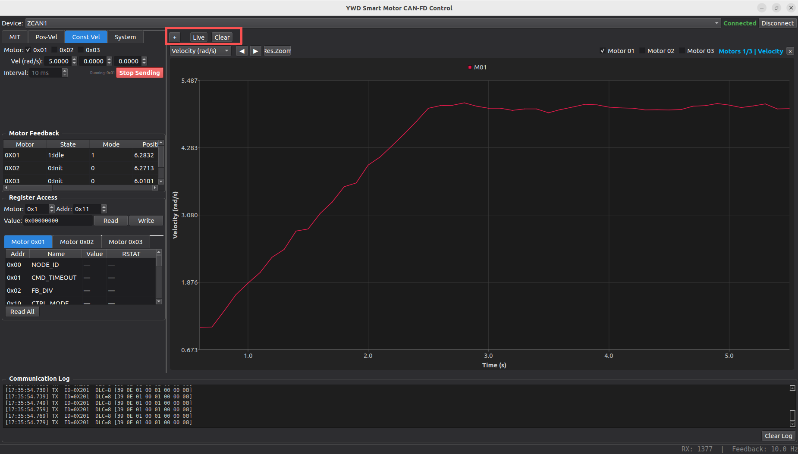

The right-hand **plot panel** shows feedback signals as live time-series
curves. The **`+`** button adds a new diagram; each diagram shows one signal
type for the selected motors over a rolling 5-second window.

Per diagram:

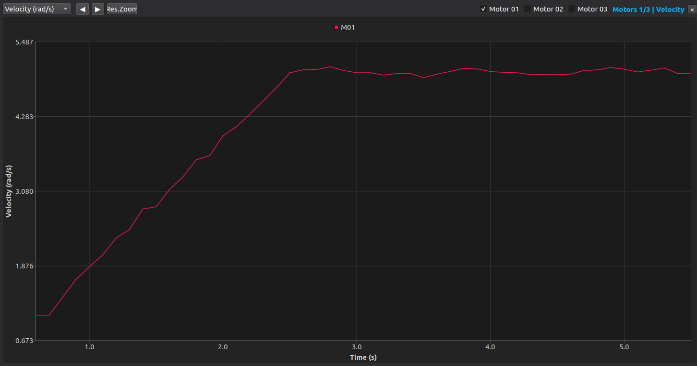

- **Signal selector** (top-left of the diagram): `Position (rad)`,
  `Velocity (rad/s)`, `Torque (N·m)`, `Voltage (V)`, `MOS Temp (°C)`,
  `Motor Temp (°C)`.
- **Motor checkboxes** `Motor 01 / 02 / 03`: toggle which motors' curves are
  drawn. Checking a motor creates its curve immediately; unchecked motors are
  skipped. Motors that appear in the feedback stream are auto-added and
  auto-checked so you never miss data.
- **Navigation**: `◀` / `▶` scroll back/forward through the buffered history
  (each buffer slot holds one control-period sample); press `Live` to jump
  back to real time.
- **Zoom**: drag a rectangle with the mouse to zoom into a region; **Res. Zoom**
  restores the full view.
- **Pause / Resume** freezes/unfreezes live updates; **Clear** empties the
  plot buffer.
- **`×`** closes the diagram.

Every new feedback sample pushes one point per motor, so plotting precision
matches the control period you selected. The plot is fed by **both**
single-motor feedback (`0x600|node`) and aggregate feedback frames
(`0x701/0x702/0x703`) — when you run 2–3 motors with aggregate frames, all of
them are plotted.

### 9.1 Typical use

1. Start a control mode (§5.5) so feedback flows continuously.
2. If the plot panel is empty, press **`+`** to add a diagram.
3. Pick the signal you care about (e.g. `Position (rad)`) in the diagram's
   signal selector and tick the motors to show (`Motor 01 / 02 / 03`).
4. Motors present in the feedback stream are auto-added and auto-checked, so
   for a 2-motor aggregate run both curves appear without manual setup.
5. Drag a rectangle to zoom into a transient; press **Res. Zoom** to restore.
6. Use `◀` / `▶` to review history, **Live** to return to real time,
   **Pause** to freeze a waveform you want to study, and **Clear** to discard
   the buffered data.
7. Close unneeded diagrams with **`×`**.

---

## 10. Communication Log

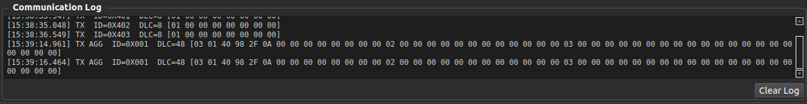

The bottom pane logs every transmitted/received frame:

```
[10:23:45.123] TX  ID=0x0180  DLC=12 [00 00 00 80 00 00 F4 01 32 00 00 00]
```

- Each line shows a timestamp, direction (`TX`/`RX`), the frame ID, DLC and
  the payload bytes in hex (bracketed).
- **Reading a log line:** `TX` = sent by the GUI, `RX` = received from the
  bus. `ID=0x0180` = 0x180 + node 0 → single-frame Pos-Vel command for
  Motor 01. A `TX agg` prefix (instead of `TX`) marks an aggregate control
  frame (`0x001/0x002/0x003`). The byte layout of each ID is defined in §11
  and in the two protocol documents.
- **Feedback frames are intentionally not logged** (both `0x600|node` and
  aggregate feedback) to avoid flooding the log during continuous control —
  they are already visible in the feedback table and the plot. The status
  bar's `RX:` counter and `Feedback: x.x Hz` still confirm reception.
- Use **Clear Log** to wipe the view. The log keeps the most recent 2000 lines.

---

## 11. Protocol Reference (summary)

| Frame | CAN ID | Direction | Purpose |
|-------|--------|-----------|---------|
| MIT control (single) | `0x100 + node` | H→D | MIT torque-control setpoint |
| Pos-Vel control (single) | `0x180 + node` | H→D | Position + velocity-limit setpoint |
| Const-Vel control (single) | `0x200 + node` | H→D | Constant-velocity setpoint |
| System command | `0x400 + node` | H→D | Enable/disable/zero/… (§6) |
| Feedback | `0x600 + node` | D→H | Single-motor feedback (§7) |
| Aggregate MIT control | `0x001` | H→D | Multi-motor MIT (≤3 records) |
| Aggregate Pos-Vel control | `0x002` | H→D | Multi-motor Pos-Vel (≤3 records) |
| Aggregate Const-Vel control | `0x003` | H→D | Multi-motor Const-Vel (≤3 records) |
| Aggregate feedback (MIT) | `0x701` | D→H | Multi-motor MIT feedback |
| Aggregate feedback (Pos-Vel) | `0x702` | D→H | Multi-motor Pos-Vel feedback |
| Aggregate feedback (Const-Vel) | `0x703` | D→H | Multi-motor Const-Vel feedback |
| Register R/W | `0x700 + node` | H→D | Param read (0x02) / write (0x01) |
| Register response | `0x700 + node` | D→H | Param response with RSTAT |
| Broadcast (any mode) | `0x000` / `0x0FF` | H→D | Reserved for broadcast use |

**Key scaling factors** (identical in single and aggregate encodings):

- Position: `p_des = pos / PMAX * (2³¹ − 1)` (int32)
- Velocity (MIT/CV): `v_des = vel / VMAX * 32767` (int16)
- Velocity limit (PV aggregate): `v_max = vel / VMAX * 65535` (uint16)
- `Kp` = 0.01 per LSB, `Kd` = 0.001 per LSB (uint16)
- Feed-forward torque: `t_ff = trq / TMAX * 32767` (int16)
- Acceleration / deceleration: 1 rad/s² per LSB (uint16), `0` = use register
  default (registers 0x14/0x15)
- Bus voltage telemetry: 0.01 V per LSB

---

## 12. Troubleshooting

| Symptom | Likely cause / fix |
|---------|--------------------|
| `VCI_OpenDevice failed` | Adapter not plugged in, not a ZCAN device, or USB permissions — run as root / add udev rule |
| `VCI_InitCAN failed` | Bus not terminated, or the fixed 1 Mbps / 5 Mbps bit-rate does not match the bus |
| Connect succeeds but no feedback | Wrong NODE_ID wiring; check the motor address and that the motor is powered |
| Motor does not move after Start | Motor not **Enabled** first (System tab → Enable); check fault code in the table |
| Only some motors plot | Ensure their checkboxes are ticked; aggregate feedback (`0x701–0x703`) must be enabled on the firmware side (it is decoded automatically by the GUI) |
| Fault 0x06 (comm lost) | Control interval too long for the configured `CMD_TIMEOUT`, or bus error frames — shorten the send interval or raise CMD_TIMEOUT |
| Register read shows `Unknown RID` | Firmware does not support that register on this motor variant |
| `Write OK` but no effect | Parameter may be protected by state (RSTAT `State forbid`), or must be **Saved** before power-off |
